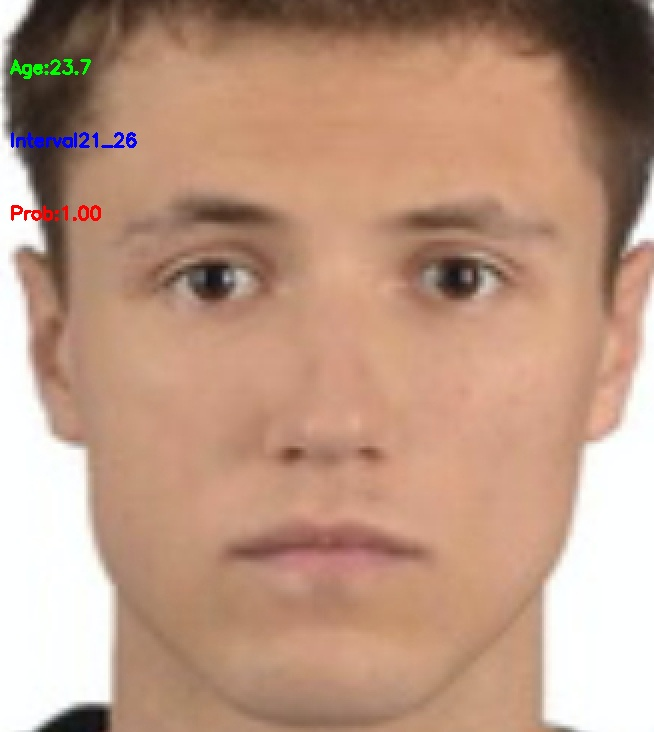

# ssrnet.lite.ai.toolkit
使用 [🍅🍅 Lite.AI.ToolKit](https://github.com/DefTruth/lite.ai.toolkit) C++工具箱来跑SSRNet年龄估计的一些案例, 包含ONNXRuntime C++、MNN和TNN版本。SSRNet的权重文件大小只有 **190Kb** ，是一个非常轻量级的年龄估计模型。

<div align='center'>
  
  
  
</div>  


如果觉得有用，不妨给个Star⭐️🌟支持一下吧~ 🙃🤪🍀

## 2. C++版本源码

SSRNet C++ 版本的源码包含ONNXRuntime、MNN和TNN三个版本，源码可以在 [lite.ai.toolkit](https://github.com/DefTruth/lite.ai.toolkit) 工具箱中找到。本项目主要介绍如何基于 [lite.ai.toolkit](https://github.com/DefTruth/lite.ai.toolkit) 工具箱，直接使用SSRNet来跑人脸检测。需要说明的是，本项目是基于MacOS下编译的 [liblite.ai.toolkit.v0.1.0.dylib](https://github.com/DefTruth/yolox.lite.ai.toolkit/blob/main/lite.ai.toolkit/lib) 来实现的，对于使用MacOS的用户，可以直接下载本项目包含的*liblite.ai.toolkit.v0.1.0*动态库和其他依赖库进行使用。而非MacOS用户，则需要从[lite.ai.toolkit](https://github.com/DefTruth/lite.ai.toolkit) 中下载源码进行编译。[lite.ai.toolkit](https://github.com/DefTruth/lite.ai.toolkit) c++工具箱目前包含80+流行的开源模型，就不多介绍了，只是平时顺手捏的，整合了自己学习过程中接触到的一些模型，感兴趣的同学可以去看看。
* [ssrnet.cpp](https://github.com/DefTruth/lite.ai.toolkit/blob/main/lite/ort/cv/ssrnet.cpp)
* [ssrnet.h](https://github.com/DefTruth/lite.ai.toolkit/blob/main/lite/ort/cv/ssrnet.h)
* [mnn_ssrnet.cpp](https://github.com/DefTruth/lite.ai.toolkit/blob/main/lite/mnn/cv/mnn_ssrnet.cpp)
* [mnn_ssrnet.h](https://github.com/DefTruth/lite.ai.toolkit/blob/main/lite/mnn/cv/mnn_ssrnet.h)
* [tnn_ssrnet.cpp](https://github.com/DefTruth/lite.ai.toolkit/blob/main/lite/tnn/cv/tnn_ssrnet.cpp)
* [tnn_ssrnet.h](https://github.com/DefTruth/lite.ai.toolkit/blob/main/lite/tnn/cv/tnn_ssrnet.h)

ONNXRuntime C++、MNN和TNN版本的推理实现均已测试通过，欢迎白嫖~  

## 3. 模型文件

### 3.1 ONNX模型文件
可以从我提供的链接下载 ([Baidu Drive](https://pan.baidu.com/s/1elUGcx7CZkkjEoYhTMwTRQ) code: 8gin) , 也可以从本直接仓库下载。


|                 Class                 |      Pretrained ONNX Files      |              Rename or Converted From (Repo)              | Size  |
| :-----------------------------------: | :-----------------------------: | :-------------------------------------------------------: | :---: |  
|     *lite::cv::face::attr::SSRNet*      |               ssrnet.onnx                | [SSR_Net...](https://github.com/oukohou/SSR_Net_Pytorch) | 190Kb |


### 3.2 MNN模型文件
MNN模型文件下载地址，([Baidu Drive](https://pan.baidu.com/s/1KyO-bCYUv6qPq2M8BH_Okg) code: 9v63), 也可以从本直接仓库下载。

|                 Class                 |      Pretrained MNN Files      |              Rename or Converted From (Repo)              | Size  |
| :-----------------------------------: | :-----------------------------: | :-------------------------------------------------------: | :---: |
|     *lite::mnn::cv::face::attr::SSRNet*      |               ssrnet.mnn                | [SSR_Net...](https://github.com/oukohou/SSR_Net_Pytorch) | 190Kb |

### 3.3 TNN模型文件
TNN模型文件下载地址，([Baidu Drive](https://pan.baidu.com/s/1lvM2YKyUbEc5HKVtqITpcw) code: 6o6k), 也可以从本直接仓库下载。

|                 Class                 |      Pretrained TNN Files      |              Rename or Converted From (Repo)              | Size  |
| :-----------------------------------: | :-----------------------------: | :-------------------------------------------------------: | :---: |
|     *lite::tnn::cv::face::attr::SSRNet*      |               ssrnet.opt.tnnproto&tnnmodel                | [SSR_Net...](https://github.com/oukohou/SSR_Net_Pytorch) | 190Kb |


## 4. 接口文档

在[lite.ai.toolkit](https://github.com/DefTruth/lite.ai.toolkit) 中，SSRNet的实现类为：

```c++
class LITE_EXPORTS lite::cv::face::attr::SSRNet;
class LITE_EXPORTS lite::mnn::cv::face::attr::SSRNet;
class LITE_EXPORTS lite::tnn::cv::face::attr::SSRNet;
```  

该类型目前包含1公共接口`detect`用于进行年龄检测。
```c++
public:
  void detect(const cv::Mat &mat, types::Age &age);
```
`detect`接口的输入参数说明：
* mat: cv::Mat类型，BGR格式，一张包含人脸头部的图片（不包含过多的背景）。
* age: types::Age，包含被检测到的年龄; 

## 5. 使用案例

### 5.1 ONNXRuntime版本
```c++
#include "lite/lite.h"

static void test_default()
{
    std::string onnx_path = "../hub/onnx/cv/ssrnet.onnx";
    std::string test_img_path = "../resources/1.png";
    std::string save_img_path = "../logs/1.jpg";
    
    auto *ssrnet = new lite::cv::face::attr::SSRNet(onnx_path);
    
    lite::types::Age age;
    cv::Mat img_bgr = cv::imread(test_img_path);
    ssrnet->detect(img_bgr, age);
    
    lite::utils::draw_age_inplace(img_bgr, age);
    
    cv::imwrite(save_img_path, img_bgr);
    
    std::cout << "Default Version Done! Detected SSRNet Age: " << age.age << std::endl;
    
    delete ssrnet;
}
```  

### 5.2 MNN版本
```c++
#include "lite/lite.h"

static void test_mnn()
{
#ifdef ENABLE_MNN
    std::string mnn_path = "../hub/mnn/cv/ssrnet.mnn";
    std::string test_img_path = "../resources/3.png";
    std::string save_img_path = "../logs/3_mnn.jpg";
    
    auto *ssrnet = new lite::mnn::cv::face::attr::SSRNet(mnn_path);
    
    lite::types::Age age;
    cv::Mat img_bgr = cv::imread(test_img_path);
    ssrnet->detect(img_bgr, age);
    
    lite::utils::draw_age_inplace(img_bgr, age);
    
    cv::imwrite(save_img_path, img_bgr);
    
    std::cout << "MNN Version Done! Detected SSRNet Age: " << age.age << std::endl;
    
    delete ssrnet;
#endif
}
```  

### 5.3 TNN版本
```c++
#include "lite/lite.h"

static void test_tnn()
{
#ifdef ENABLE_TNN
    std::string proto_path = "../hub/tnn/cv/ssrnet.opt.tnnproto";
    std::string model_path = "../hub/tnn/cv/ssrnet.opt.tnnmodel";
    std::string test_img_path = "../resources/4.png";
    std::string save_img_path = "../logs/4_tnn.jpg";
    
    auto *ssrnet = new lite::tnn::cv::face::attr::SSRNet(proto_path, model_path);
    
    lite::types::Age age;
    cv::Mat img_bgr = cv::imread(test_img_path);
    ssrnet->detect(img_bgr, age);
    
    lite::utils::draw_age_inplace(img_bgr, age);
    
    cv::imwrite(save_img_path, img_bgr);
    
    std::cout << "TNN Version Done! Detected SSRNet Age: " << age.age << std::endl;
    
    delete ssrnet;
#endif
}
```  


* 输出结果为:

<div align='center'>
  
  
  
</div>  

## 6. 编译运行
在MacOS下可以直接编译运行本项目，无需下载其他依赖库。其他系统则需要从[lite.ai.toolkit](https://github.com/DefTruth/lite.ai.toolkit) 中下载源码先编译*lite.ai.toolkit.v0.1.0*动态库。
```shell
git clone --depth=1 https://github.com/DefTruth/ssrnet.lite.ai.toolkit.git
cd ssrnet.lite.ai.toolkit 
sh ./build.sh
```  

* CMakeLists.txt设置

```cmake
cmake_minimum_required(VERSION 3.17)
project(ssrnet.lite.ai.toolkit)

set(CMAKE_CXX_STANDARD 11)

# setting up lite.ai.toolkit
set(LITE_AI_DIR ${CMAKE_SOURCE_DIR}/lite.ai.toolkit)
set(LITE_AI_INCLUDE_DIR ${LITE_AI_DIR}/include)
set(LITE_AI_LIBRARY_DIR ${LITE_AI_DIR}/lib)
include_directories(${LITE_AI_INCLUDE_DIR})
link_directories(${LITE_AI_LIBRARY_DIR})

set(OpenCV_LIBS
        opencv_highgui
        opencv_core
        opencv_imgcodecs
        opencv_imgproc
        opencv_video
        opencv_videoio
        )
# add your executable
set(EXECUTABLE_OUTPUT_PATH ${CMAKE_SOURCE_DIR}/examples/build)

add_executable(lite_ssrnet examples/test_lite_ssrnet.cpp)
target_link_libraries(lite_ssrnet
        lite.ai.toolkit
        onnxruntime
        MNN  # need, if built lite.ai.toolkit with ENABLE_MNN=ON,  default OFF
        ncnn # need, if built lite.ai.toolkit with ENABLE_NCNN=ON, default OFF
        TNN  # need, if built lite.ai.toolkit with ENABLE_TNN=ON,  default OFF
        ${OpenCV_LIBS})  # link lite.ai.toolkit & other libs.
```

* building && testing information:
```shell
[ 50%] Building CXX object CMakeFiles/lite_ssrnet.dir/examples/test_lite_ssrnet.cpp.o
[100%] Linking CXX executable lite_ssrnet
[100%] Built target lite_ssrnet
Testing Start ...
LITEORT_DEBUG LogId: ../hub/onnx/cv/ssrnet.onnx
=============== Input-Dims ==============
input_node_dims: 1
input_node_dims: 3
input_node_dims: 64
input_node_dims: 64
=============== Output-Dims ==============
Output: 0 Name: age Dim: 0 :1
========================================
Default Version Done! Detected SSRNet Age: 35.567
LITEORT_DEBUG LogId: ../hub/onnx/cv/ssrnet.onnx
=============== Input-Dims ==============
input_node_dims: 1
input_node_dims: 3
input_node_dims: 64
input_node_dims: 64
=============== Output-Dims ==============
Output: 0 Name: age Dim: 0 :1
========================================
ONNXRuntime Version Done! Detected SSRNet Age: 27.4245
LITEMNN_DEBUG LogId: ../hub/mnn/cv/ssrnet.mnn
=============== Input-Dims ==============
        **Tensor shape**: 1, 3, 64, 64, 
Dimension Type: (CAFFE/PyTorch/ONNX)NCHW
=============== Output-Dims ==============
getSessionOutputAll done!
Output: age:    **Tensor shape**: 1, 
========================================
MNN Version Done! Detected SSRNet Age: 33.37
LITETNN_DEBUG LogId: ../hub/tnn/cv/ssrnet.opt.tnnproto
=============== Input-Dims ==============
input: [1 3 64 64 ]
Input Data Format: NCHW
=============== Output-Dims ==============
age: [1 ]
========================================
TNN Version Done! Detected SSRNet Age: 23.7442
Testing Successful !
```  
